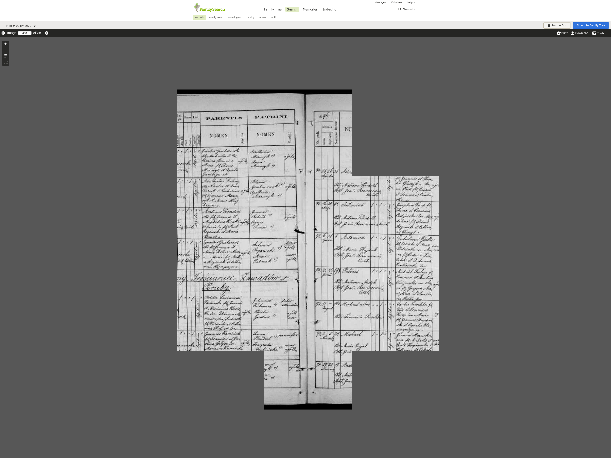

# zapisywacz-skanow-familysearch v1.1.0


https://www.cisowscy.com/Narzedzia-dla-Genealoga/Mormoni/FamilySearch

Mili Państwo chcielibyśmy przedstawić pewną sztuczkę, niejednemu genealogowi wygospodarowywującą nawet że, z godzinkę czasu.

Zapewne nie jeden z nas, boryka się z szeregiem męk wynikających z nieporęczności czy też poniekąd niefunkcjonalności, pewnych rozwiązań stosowanych przez Mormonów na ich, że wielce pożądanej stronie — FamilySearch — posiadającej skany metryk, z niejednego zakątka świata. Prezentowane tu rozwiązanie usprawniające pewną niedogodność — póki czas nie pozwoli — jest solidnie siermiężne, aczkolwiek mimo wszystko pewien frasunek z naszych bark zdejmuje.

Wykorzystamy zaoszczędzony czas by w zaciszu zanurzyć się w przyjemnej lekturze, tudzież pójść zaparzyć ulubionej herbaty. Zachęcamy do udostępniania tegoż postu dalej — https://www.facebook.com/Cisowscy/posts/1051352388399314 — na profilach sympatyków owej smykałki.
Jak i dzielenie się zwłaszcza w grupach i na stronach ku genealogi i kresom ukierunkowanych. Tym drugim gdyż to z Lwowskiego archiwum, skany naprzykrzały się nie chcąc się w żaden przyjemny sposób zapisać  :)

# WYMAGANIA

1) Jest to skrypt napisany w JavaScript, aby go uruchomić potrzebujesz mieć środowisko wykonawcze a jest nim node.JS dlatrgo na samym poczatku zainstaluj sobie je https://nodejs.org/
2) Dobrze jest się zaopatrzyć w pożądną nowoczesną konsolę Microsoft PowerShell 6.2 https://github.com/PowerShell/PowerShell/releases
3) Jeżeli jeszcze nie pośadasz (a możesz posiadać gdyż niektóre programy instalują go w tle) środowiska kontroli wersji GIT i ono będzie potrzebne https://git-scm.com/download

# INSTALACJA naszego programu

### 1) Utwórz na dysku w dowolnym miejscu folder o dowolnej nazwie a w nim uruchom konsolę np PowerShell 6


### 2) Sklonuj teraz repozytorium  niniejszego skryptu, w tym celu skopiuj i wklej w konsoli i potwierdź enterem poniższą linijkę

`git clone https://github.com/Cisowscy/zapisywacz-skanow-familysearch.git`


jeśli pojawii sie jakiś problem to znaczy że nie spełniasz wymagania nr 3 i wówczas poprostu zainstaluj git  https://git-scm.com/download i wykonaj ten krok ponownie

### 3) będąc nadal w konsoli wklej poniższe 2 polecenia każdorazowo potwierdzając je enterem 

`cd zapisywacz-skanow-familysearch`

`npm i`

możesz teraz zamnąć konsolę (albo i nie)

-------------------------------------------------------------------------

# Hurra wszystko już posiadasz teraz możesz używać :) 

- **Nazwy plików PNG są równoznaczne z numerem klisz/stron w przeglądarce na FamilySearch**
- Każde nowe uruchomienie tworzy nowy podfolder w folderze **`Download`** jest to np **`ZADANIE_1549660814544`** numer jest to data utworzenia folderu podana w milisekundach. Jest to zabezpiecznie przed problemem próby zapisu już istniejącego pliku.

# Użytkowanie - Login i Hasło

Posiadasz folder  **`Config`** otwórz go a wnim jest **`UWIERZYTELNIENIE.TXT`** 

```json
{
    "Twoja_nazwa_uzytkownika_FamilySearch" : "AlaMaKota",
    "Twoje_haslo_uzytkownika_FamilySearch" : "123456789"
}
```
Wpisz zamiast **AlaMaKota** twoją nazwę logowania a zamiast **123456789** twoje hasło do FamilySearch.

# Użytkowanie - Określanie co ma zostać ściągnięte

Posiadasz folder  **`Config`** otwórz go a wnim jest **`ZADANIA.TXT`** 
```json
{
    "adres_przegladarki_filmu": "https://www.familysearch.org/ark:/61903/3:1:33S7-9RQ4-QP7?i=15&cc=1910265&cat=260556",
    "numer_ostatniej_kliszy_filmu": 861,
    "zapisz_klisze_od_numeru": 426,
    "zapisz_klisze_do_numeru": 623
}
```
Zamień teraz te dane na swoje. 

# Problemy - wolnego łącza internetowego

Może się zdarzyć że strona zostanie źle zapisana  np tak:



jest to spowodowane zbyt wolnym łączem, lub zbyt dużym obciążeniem serwerów FamilySearch
Możesz albo w nowym zadaniu te konkretnie strony pobrać ponownie, może anuż tym razem będzie wszystko ok. albo wydłużyć czas wczytywania i wyostrzania stron.

Posiadasz folder  **`Config`** otwórz go a wnim jest **`KONFIGURACJA.txt`** 
```json
{
    "czas_w_sekundach_potrzebny_na_wyostrzenie_widoku" : 25,
    "rozdzielczosc_w_jakiej_dokonasz_zdjecia_kliszy" : {
        "szerokosc_w_pixelach": 3200,
        "wysokosc_w_pixelach": 2400 
    }
}
```

# URUCHOMIENIE

Możesz albo kliknąć dwukrotnie `URUCHOM.cmd` albo jeżeli jeszcze nie zamknołeś konsoli wpisać w niej **`node src/app.js`** i zatwierdzić enterem, jest to dokładnie to samo.

## Z poważaniem i wyrazami szacunku autor
p.s wszelkie poprawki Państwa są mile widziane :) 